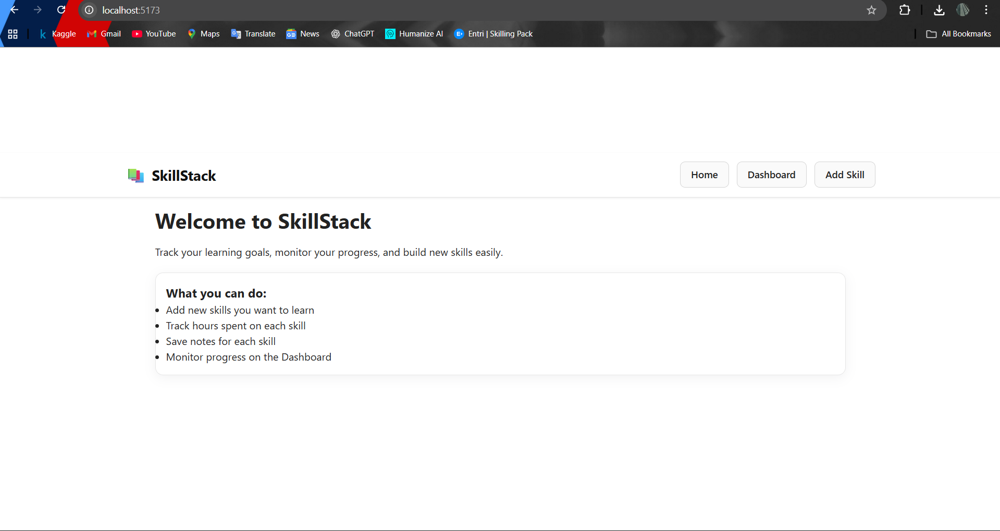
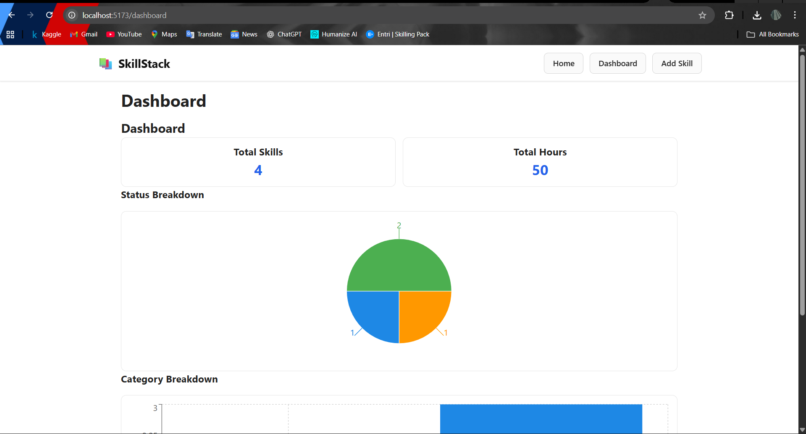
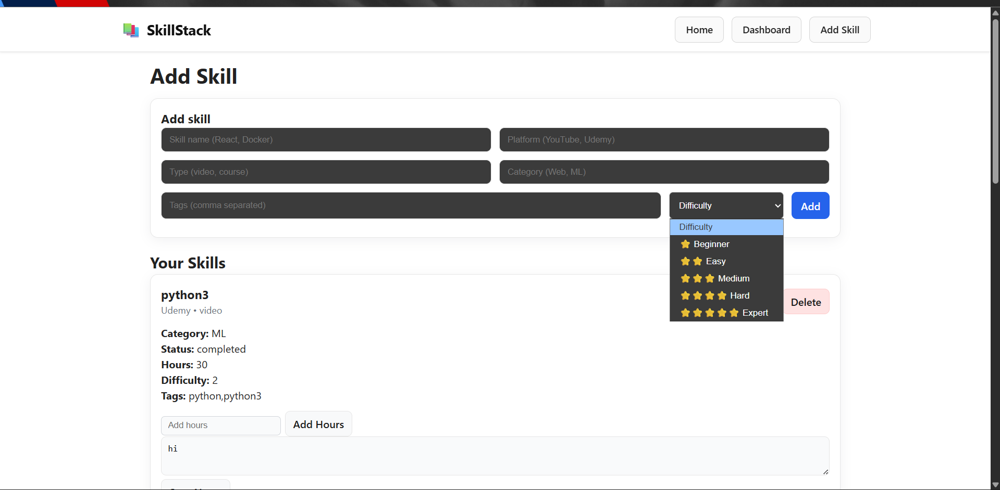

# 📚 SkillStack – Personal Skill Building & Learning Tracker

SkillStack is a simple, intuitive platform built to help learners track their learning goals, monitor progress, log hours, and visualize their growth using charts and dashboards.

This project was developed as part of a technical assignment and demonstrates full-stack development using **React (Vite)** for the frontend and **FastAPI + SQLModel** for the backend.

---


##  Features

###  Skill Management
- Add new skills with:
  - Name  
  - Platform (YouTube, Udemy, Coursera…)  
  - Resource Type (Video, Course, Article)  
  - Category  
  - Tags  
- Update skill progress:
  - Toggle **Not Started → In-Progress → Completed**
  - Add hours spent  
  - Save notes  
- Delete skills anytime  

---

###  Dashboard & Insights
- Pie chart for **status breakdown**
- Bar chart for **skill categories**
- Total hours learned
- Total skills count
- Fully responsive dashboard

---

##  Tech Stack

### **Frontend**
- React (Vite)
- React Router DOM
- Recharts
- Custom CSS
- Vercel (deployment)

### **Backend**
- FastAPI
- SQLModel
- SQLite Database
- Uvicorn

---


---

##  Installation & Setup

###  Backend Setup (FastAPI)

```bash
cd skillstack-backend
python -m venv venv
venv\Scripts\activate
pip install -r requirements.txt
uvicorn app.main:app --reload --port 8001
```

Runs at:
```bash
http://127.0.0.1:8001
```

### Frontend Setup (React + Vite)
```bash
cd skillstack-frontend
npm install
npm run dev
```

Runs at:
```bash
http://localhost:5173
```

### API Documentation
Base URL (Local backend)
```bash
http://127.0.0.1:8001
```
### Screenshots

### Home

### Dashboard


### Add Skill Page


### Future Improvements
---
AI recommendations

Estimated skill mastery timelines

Auto skill categorization

---

##  Live Deployment

###  **Live Frontend (Vercel)**  
🔗 https://skillstack-frontend-git-main-harlins-projects-3da29b35.vercel.app

### Backend  
*(Backend not deployed)*  
The app runs fully when connected to a local FastAPI backend.

